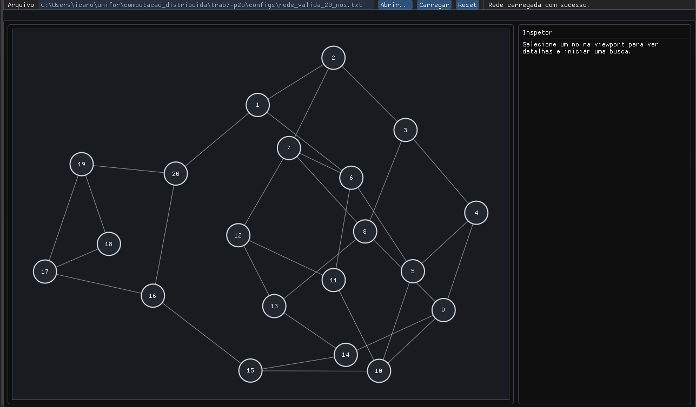
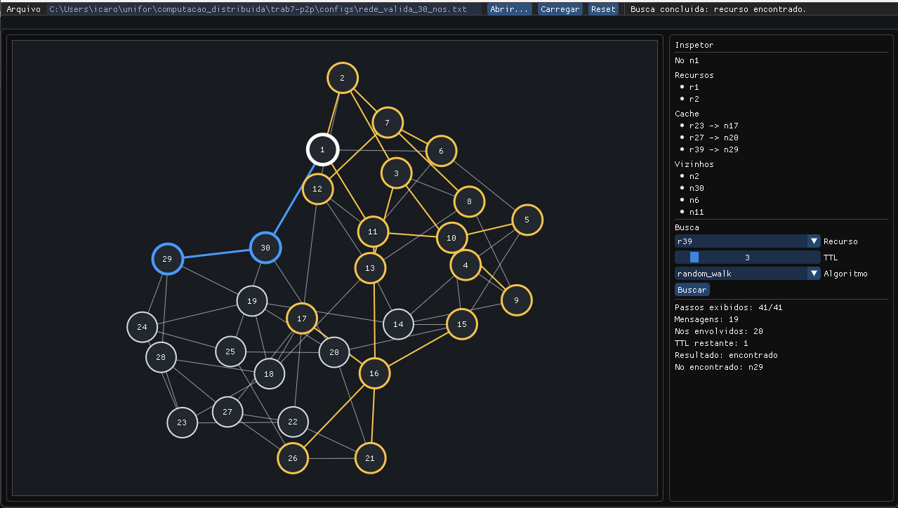

# Simulador de Rede P2P

## Equipe

- Ícaro Molina - 2310334
- Mateus Maia - 2310323
- Nelson Mateus - 2316448

## Contexto

Este projeto simula uma rede P2P em C++. A rede é montada a partir de um arquivo `.txt`, permitindo carregar uma topologia, visualizar os nós e executar buscas por recursos usando diferentes estratégias de propagação.

## Interface



Durante a execução da busca, a visualização destaca os caminhos percorridos pela requisição. As arestas em amarelo representam caminhos visitados durante o processo, enquanto o caminho em azul indica a rota final que encontrou o recurso.



## Arquivo de entrada

O arquivo de entrada define a quantidade de nós, os limites de vizinhos, os recursos de cada nó e as conexões da rede.

Exemplo:

```txt
num_nodes: 6
min_neighbors: 1
max_neighbors: 3
resources:
n1: r1, r2
n2: r3
n3: r4
n4: r5
n5: r6
n6: r7
edges:
n1, n2
n1, n3
n2, n4
n3, n5
n4, n6
n5, n6
```

## Algoritmos

### Flooding

No flooding, a busca começa em um nó de origem e é enviada para todos os seus vizinhos. Cada nó que recebe a requisição verifica se possui o recurso procurado ou, na versão informada, se conhece o recurso em cache. Caso não encontre, ele repassa a busca para seus próprios vizinhos enquanto ainda houver TTL disponível.

Para evitar repetição desnecessária, o algoritmo controla os nós já visitados e só adiciona novos nós à próxima onda de busca quando eles ainda não receberam a requisição. Quando o recurso é encontrado, o caminho é reconstruído a partir do nó de origem até o nó que respondeu.

### Random Search

No random search, a busca também parte de um nó de origem, mas não é enviada para todos os vizinhos ao mesmo tempo. Em vez disso, os vizinhos são embaralhados e o algoritmo tenta seguir um caminho por vez, de forma semelhante a uma DFS.

Cada envio consome uma unidade do TTL. O algoritmo mantém um conjunto de nós já visitados para evitar ciclos, como voltar de um nó para o anterior. Se um caminho não encontra o recurso, a busca retorna e tenta outro vizinho ainda não visitado. Na versão informada, o nó também pode responder usando informações armazenadas em cache.

## Como usar

1. Abra a aplicação e carregue um arquivo `.txt` com a configuração da rede.
2. Clique em um nó no grafo para exibir seus recursos, cache e vizinhos.
3. No painel lateral, escolha o recurso, o TTL e o algoritmo de busca.
4. Clique em `Buscar` para iniciar a busca e acompanhar a animação na rede.
